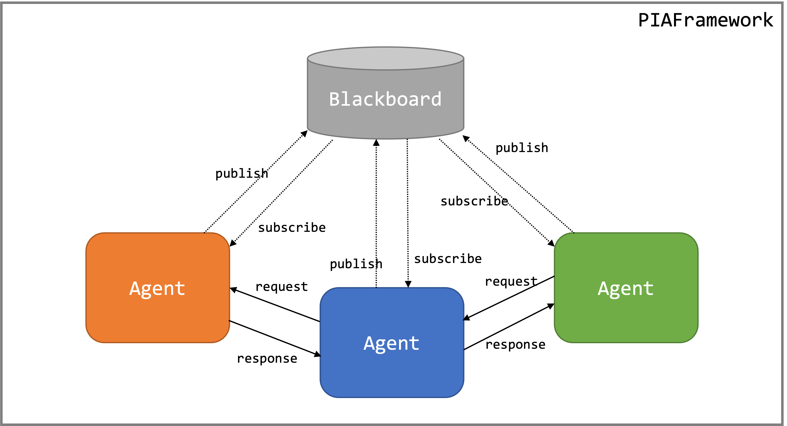

# PIAFramework : Python Intelligence Agent Framework

- Multi-Agent Interaction Framework using Python
- Framework manage agents lifecycle
- Provide Publish-Subscribe machanism through Blackboard
- Provide Request-Response machnism to directly interaction between agents